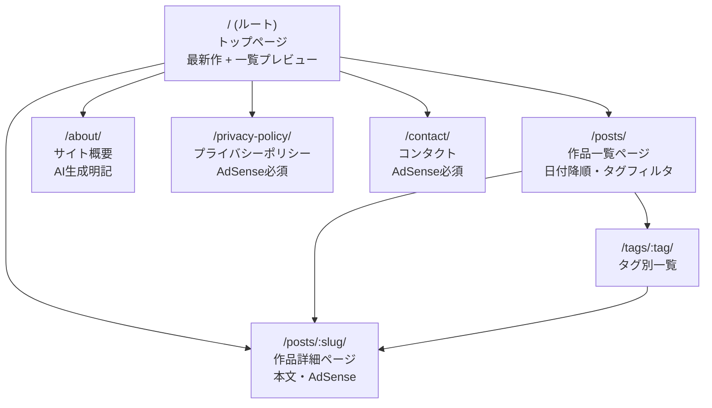
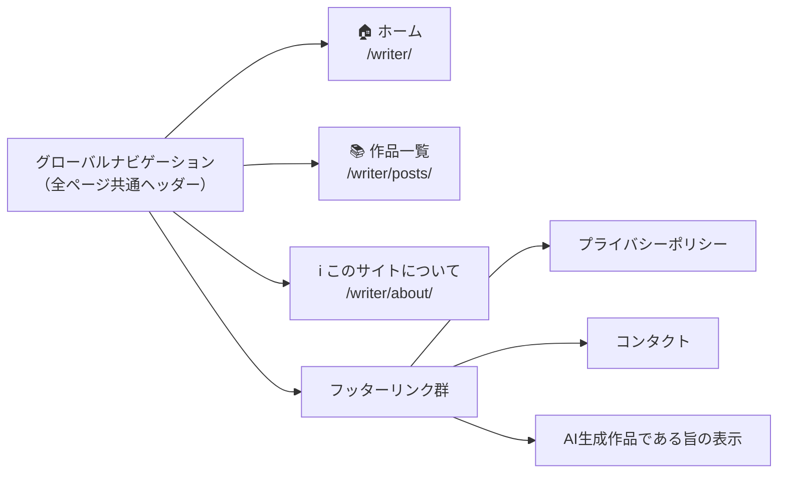
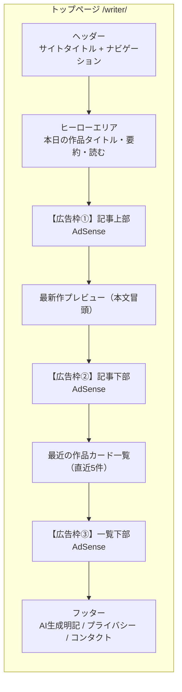
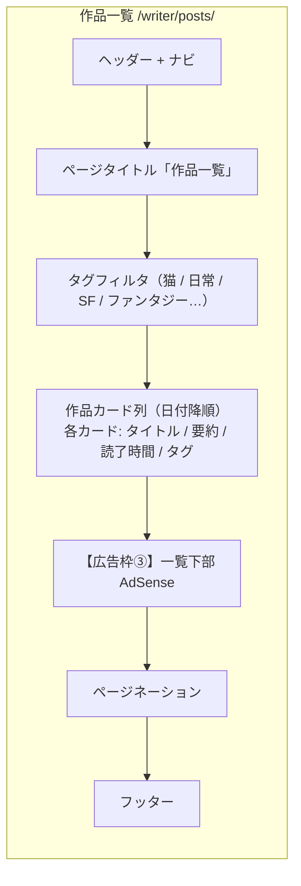
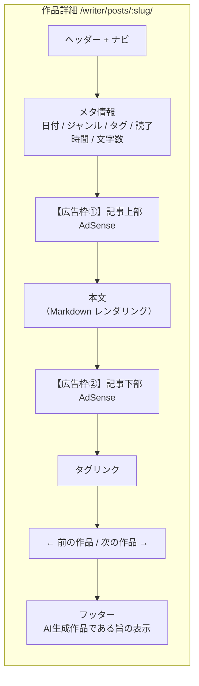
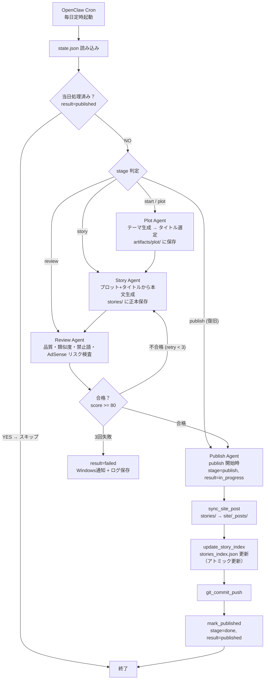
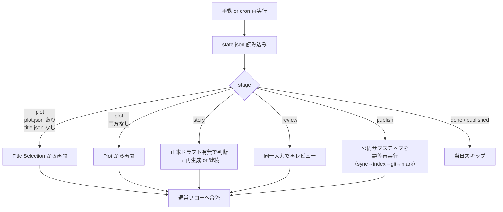
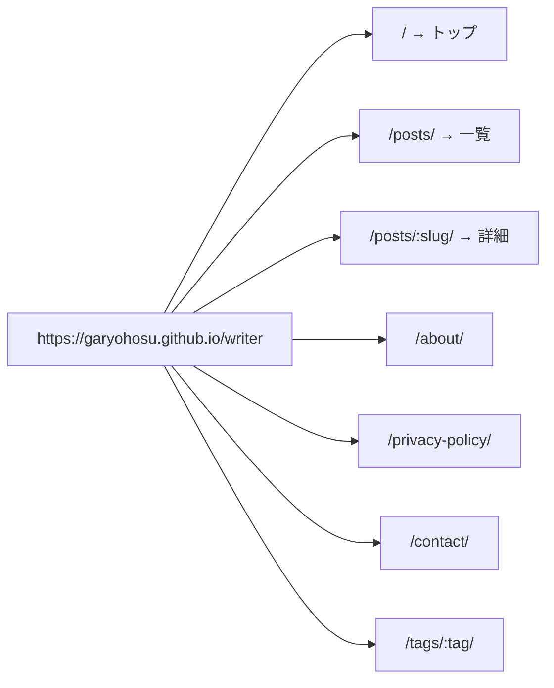

# UI.md
## 1日1冊短編小説サイト — ユーザーインターフェース設計

**Project:** DailyShortStorySite
**Version:** 1.2.0
**作成日:** 2026-03-09
**Publishing Target:** `https://garyohosu.github.io/writer`

---

## 1. サイト構造（ページ一覧）

---

## 2. ナビゲーション構成

---

## 3. トップページ レイアウト

---

## 4. 作品一覧ページ レイアウト

---

## 5. 作品詳細ページ レイアウト

---

## 6. 日次パイプライン フロー（自動運用 / automatic）

---

## 7. 障害復旧フロー

---

## 8. AdSense 広告枠 配置まとめ

| 枠番号 | 配置場所 | 対象ページ |
|---|---|---|
| ① 記事上部 | 記事メタ情報の直下、本文開始前 | トップ / 作品詳細 |
| ② 記事下部 | 本文終了直後、タグリンク前 | 作品詳細 |
| ③ 一覧下部 | 作品カード一覧の末尾、ページネーション前 | トップ / 作品一覧 |

---

## 9. URL 設計まとめ

- 内部リンクは常に `{{ site.baseurl }}/posts/:slug/` 形式で生成
- `canonical` および OGP URL は `{{ site.url }}{{ site.baseurl }}{{ page.url }}`
- ルート相対 `/posts/...` の直書き禁止（§20.2）

---

*本ドキュメントは SPEC.md §20〜21 の要件に基づいて設計した。実装時は Chirpy テーマの `_layouts/` / `_includes/` と突き合わせて調整すること。*
