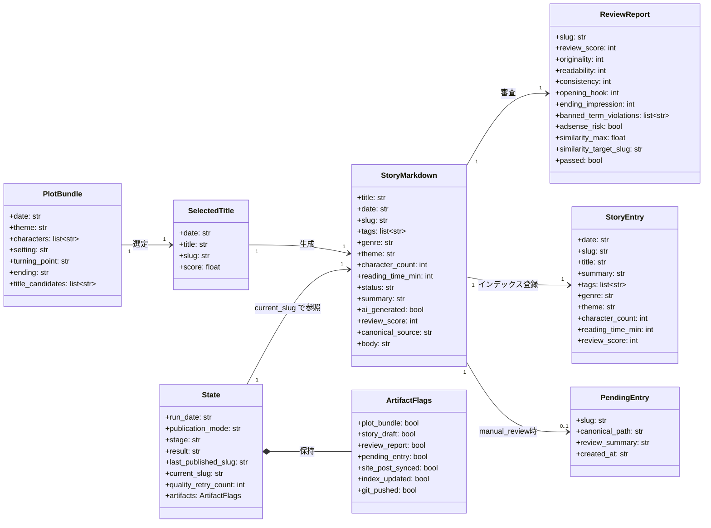
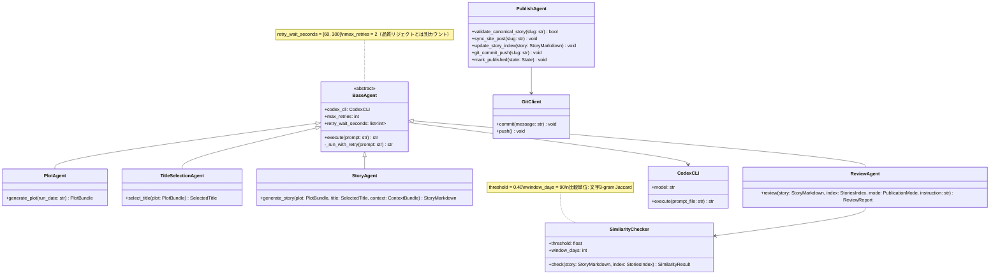
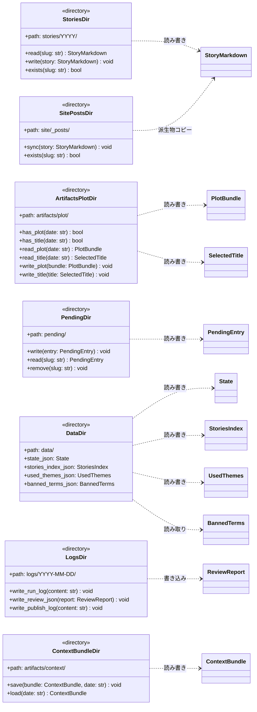

# class.md
## 1日1冊短編小説サイト — クラス図

**Project:** DailyShortStorySite
**Version:** 1.2.0
**作成日:** 2026-03-09
**参照:** SPEC.md, QandA.md

---

## 1. クラス図 全体

```mermaid
classDiagram
    direction TB

    %% ===== エントリーポイント =====
    class RunDaily {
        +run_date: str
        +state: State
        +run() void
        +resume_from_state() void
        +notify_failure(message: str) void
    }

    %% ===== 状態管理 =====
    class State {
        +run_date: str
        +publication_mode: PublicationMode
        +stage: Stage
        +result: Result
        +last_published_slug: str
        +current_slug: str
        +quality_retry_count: int
        +artifacts: ArtifactFlags
        +load(path: str) State$
        +save(path: str) void
        +is_today_done() bool
        +increment_retry() void
    }

    class ArtifactFlags {
        +plot_bundle: bool
        +story_draft: bool
        +review_report: bool
        +pending_entry: bool
        +site_post_synced: bool
        +index_updated: bool
        +git_pushed: bool
    }

    class PublicationMode {
        <<enumeration>>
        automatic
        manual_review
    }

    class Stage {
        <<enumeration>>
        start
        plot
        story
        review
        pending_review
        publish
        done
    }

    class Result {
        <<enumeration>>
        idle
        in_progress
        passed
        failed
        published
    }

    %% ===== AIエージェント基底 =====
    class BaseAgent {
        <<abstract>>
        +codex_cli: CodexCLI
        +max_retries: int
        +retry_wait_seconds: list~int~
        +execute(prompt: str) str
        -_run_with_retry(prompt: str) str
    }

    %% ===== Plot / Title エージェント =====
    class PlotAgent {
        +used_themes: UsedThemes
        +banned_terms: BannedTerms
        +generate_plot(run_date: str) PlotBundle
    }

    class TitleSelectionAgent {
        +select_title(plot: PlotBundle) SelectedTitle
        -_score_candidates(candidates: list~str~, plot: PlotBundle) dict
    }

    class PlotBundle {
        +date: str
        +theme: str
        +characters: list~str~
        +setting: str
        +turning_point: str
        +ending: str
        +title_candidates: list~str~
        +save(path: str) void
        +load(path: str) PlotBundle$
    }

    class SelectedTitle {
        +date: str
        +title: str
        +slug: str
        +score: float
        +save(path: str) void
        +load(path: str) SelectedTitle$
    }

    %% ===== Story エージェント =====
    class StoryAgent {
        +generate_story(plot: PlotBundle, title: SelectedTitle, context: ContextBundle) StoryMarkdown
        -_build_prompt(plot: PlotBundle, title: SelectedTitle, context: ContextBundle) str
        -_count_characters(text: str) int
    }

    class StoryMarkdown {
        +title: str
        +date: str
        +slug: str
        +tags: list~str~
        +genre: str
        +theme: str
        +character_count: int
        +reading_time_min: int
        +status: str
        +summary: str
        +ai_generated: bool
        +review_score: int
        +canonical_source: str
        +body: str
        +save(path: str) void
        +load(path: str) StoryMarkdown$
        +to_frontmatter() str
    }

    %% ===== Review エージェント =====
    class ReviewAgent {
        +banned_terms: BannedTerms
        +similarity_checker: SimilarityChecker
        +review(story: StoryMarkdown, index: StoriesIndex, mode: PublicationMode, instruction: str) ReviewReport
        -_check_adsense_risk(story: StoryMarkdown) bool
        -_check_banned_terms(story: StoryMarkdown) list~str~
    }

    class ReviewReport {
        +slug: str
        +review_score: int
        +originality: int
        +readability: int
        +consistency: int
        +opening_hook: int
        +ending_impression: int
        +banned_term_violations: list~str~
        +adsense_risk: bool
        +similarity_max: float
        +similarity_target_slug: str
        +passed: bool
        +save(path: str) void
        -_calculate_score() int
    }

    class SimilarityChecker {
        +threshold: float
        +window_days: int
        +check(story: StoryMarkdown, index: StoriesIndex) SimilarityResult
        -_build_ngrams(text: str, n: int) set~str~
        -_jaccard(a: set, b: set) float
    }

    class SimilarityResult {
        +max_score: float
        +target_slug: str
        +exceeded: bool
    }

    %% ===== Publish エージェント =====
    class PublishAgent {
        +stories_dir: str
        +site_posts_dir: str
        +index_path: str
        +validate_canonical_story(slug: str) bool
        +sync_site_post(slug: str) void
        +update_story_index(story: StoryMarkdown) void
        +git_commit_push(slug: str) void
        +mark_published(state: State) void
    }

    %% ===== データ管理 =====
    class StoriesIndex {
        +entries: list~StoryEntry~
        +load(path: str) StoriesIndex$
        +save(path: str) void
        +save_atomic(path: str) void
        +add_or_update(story: StoryMarkdown) void
        +get_recent(days: int) list~StoryEntry~
        +get_recent_n(n: int) list~StoryEntry~
    }

    class StoryEntry {
        +date: str
        +slug: str
        +title: str
        +summary: str
        +tags: list~str~
        +genre: str
        +theme: str
        +character_count: int
        +reading_time_min: int
        +review_score: int
    }

    class UsedThemes {
        +entries: list~ThemeEntry~
        +window_days: int
        +load(path: str) UsedThemes$
        +save(path: str) void
        +add(theme: str, date: str) void
        +get_recent(days: int) list~str~
        +prune_old() void
    }

    class BannedTerms {
        +terms: list~str~
        +load(path: str) BannedTerms$
        +check(text: str) list~str~
    }

    class ContextBundle {
        +run_date: str
        +recent_summaries: list~str~
        +used_themes_snapshot: list~str~
        +style_notes: str
        +review_input_cache: dict
        +build(date: str, index: StoriesIndex, themes: UsedThemes) ContextBundle$
        +save(path: str) void
        +load(path: str) ContextBundle$
    }

    class PendingEntry {
        +slug: str
        +canonical_path: str
        +review_summary: str
        +created_at: str
        +save(path: str) void
        +load(path: str) PendingEntry$
    }

    %% ===== 外部インターフェース =====
    class CodexCLI {
        +model: str
        +execute(prompt_file: str) str
        +execute_inline(prompt: str) str
    }

    class GitClient {
        +repo_path: str
        +commit(message: str) void
        +push() void
        +is_clean() bool
    }

    class WindowsNotifier {
        +ps1_path: str
        +notify(title: str, message: str) void
    }

    %% ===== 関係 =====
    RunDaily --> State : 読み書き
    RunDaily --> PlotAgent : 実行
    RunDaily --> TitleSelectionAgent : 実行
    RunDaily --> StoryAgent : 実行
    RunDaily --> ReviewAgent : 実行
    RunDaily --> PublishAgent : 実行
    RunDaily --> WindowsNotifier : 失敗通知

    State *-- ArtifactFlags : 保持
    State --> PublicationMode : 参照
    State --> Stage : 参照
    State --> Result : 参照

    BaseAgent <|-- PlotAgent : 継承
    BaseAgent <|-- TitleSelectionAgent : 継承
    BaseAgent <|-- StoryAgent : 継承
    BaseAgent <|-- ReviewAgent : 継承
    BaseAgent --> CodexCLI : 利用

    PlotAgent --> UsedThemes : 参照
    PlotAgent --> BannedTerms : 参照
    PlotAgent ..> PlotBundle : 生成

    TitleSelectionAgent ..> SelectedTitle : 生成

    StoryAgent --> ContextBundle : 参照
    StoryAgent ..> StoryMarkdown : 生成

    ReviewAgent --> SimilarityChecker : 利用
    ReviewAgent --> BannedTerms : 参照
    ReviewAgent ..> ReviewReport : 生成

    SimilarityChecker ..> SimilarityResult : 生成
    SimilarityChecker --> StoriesIndex : 参照

    PublishAgent --> StoriesIndex : 更新
    PublishAgent --> GitClient : 利用
    PublishAgent --> StoryMarkdown : 参照

    StoriesIndex *-- StoryEntry : 保持

    ContextBundle --> StoriesIndex : 参照
    ContextBundle --> UsedThemes : 参照
```

---

## 2. データモデル クラス図

---

## 3. エージェント クラス図（依存関係）

---

## 4. ファイルシステム対応 クラス図

---

## 5. クラス責務一覧

| クラス | 区分 | 主な責務 |
|---|---|---|
| `RunDaily` | エントリポイント | パイプライン全体のオーケストレーション・state判定・再開処理 |
| `State` | データ | パイプライン状態管理・永続化 |
| `ArtifactFlags` | データ | 各生成物の完了フラグ管理 |
| `BaseAgent` | 基底クラス | Codex CLI 呼び出し・実行失敗リトライ（60秒/300秒×2回） |
| `PlotAgent` | エージェント | テーマ・プロット生成・used_themes/banned_terms 参照 |
| `TitleSelectionAgent` | エージェント | タイトル候補採点・最適タイトル1件選定 |
| `StoryAgent` | エージェント | context bundle + plot からの本文生成・文字数計算 |
| `ReviewAgent` | エージェント | 品質審査・類似度・禁止語・AdSenseリスク総合判定 |
| `PublishAgent` | エージェント | publish 5サブステップの実行・冪等保証 |
| `SimilarityChecker` | ユーティリティ | 文字3-gram Jaccard 類似度計算（しきい値0.40） |
| `StoryMarkdown` | ドメインモデル | 作品本文・frontmatter・正本データ |
| `PlotBundle` | ドメインモデル | プロット設計データ |
| `SelectedTitle` | ドメインモデル | 選定タイトル・slug |
| `ReviewReport` | ドメインモデル | レビュー結果・スコア・合否判定 |
| `StoriesIndex` | ドメインモデル | 公開済み作品一覧・日付降順・アトミック更新 |
| `StoryEntry` | ドメインモデル | stories_index.json の1エントリ |
| `UsedThemes` | ドメインモデル | 直近90日テーマ履歴・重複抑制 |
| `BannedTerms` | ドメインモデル | 禁止語辞書・テキスト検査 |
| `ContextBundle` | ドメインモデル | Story/Review Agent への文脈 bundle（再生成可能キャッシュ） |
| `PendingEntry` | ドメインモデル | manual_review 承認待ちメタデータ（正本参照のみ） |
| `CodexCLI` | インターフェース | Codex CLI ラッパー（GPT-5.4 定額利用） |
| `GitClient` | インターフェース | git commit/push ラッパー |
| `WindowsNotifier` | インターフェース | WSL2 → powershell.exe 経由の Windows 通知 |

---

*本ドキュメントは SPEC.md §6（ディレクトリ構成）、§8（状態管理）、§11（AIエージェント構成）、§12（類似度検査）、§14（品質判定）、§15（publish責務）に基づいて設計。*
