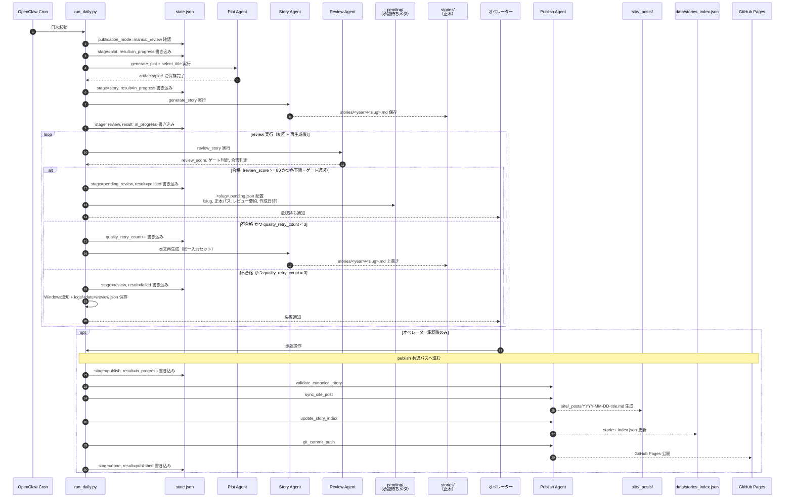
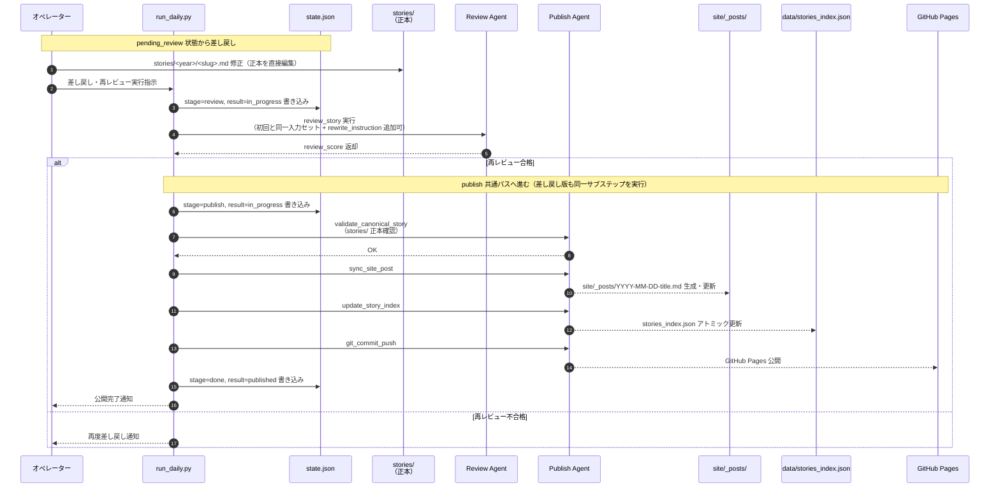
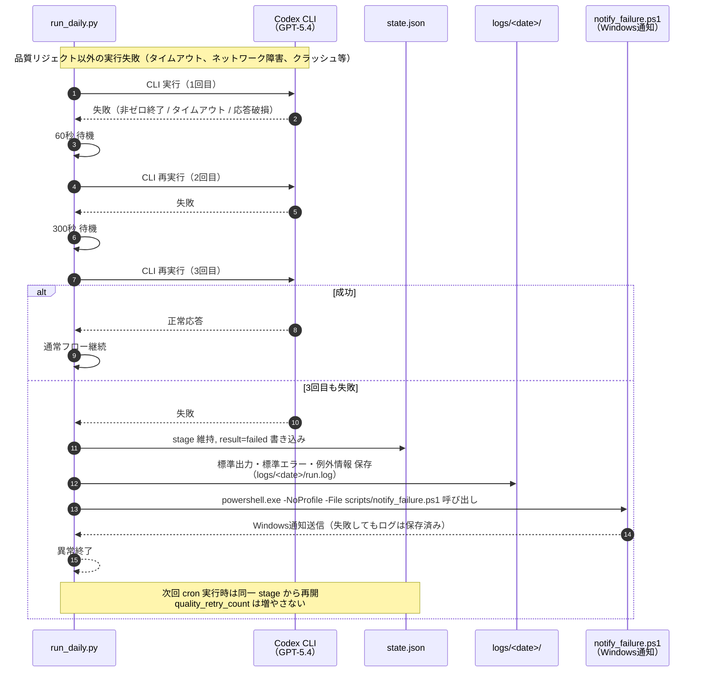
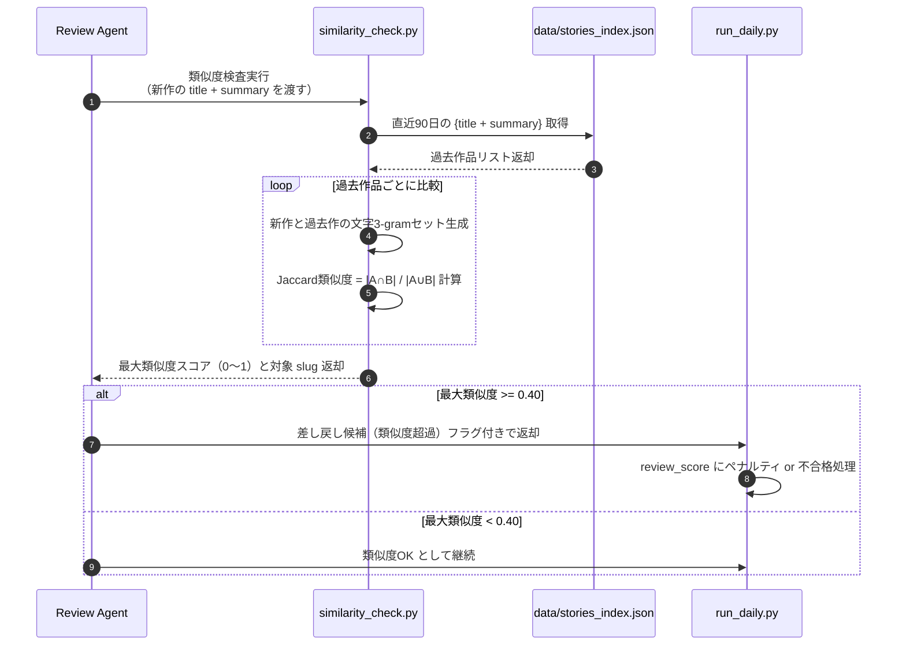
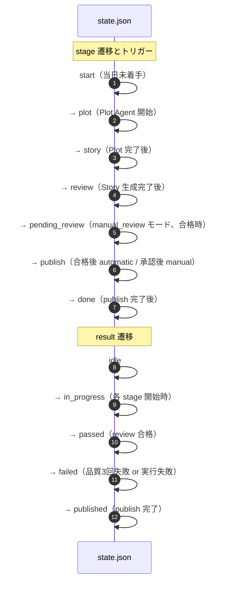

# sequence.md
## 1日1冊短編小説サイト — シーケンス図

**Project:** DailyShortStorySite
**Version:** 1.2.0
**作成日:** 2026-03-09
**参照:** SPEC.md, UI.md, QandA.md

---

## 1. 日次パイプライン 通常フロー（automatic モード）

```mermaid
sequenceDiagram
    autonumber
    participant CRON as OpenClaw Cron
    participant MAIN as run_daily.py
    participant STATE as state.json
    participant PLOT as Plot Agent<br/>(generate_plot.py)
    participant TITLE as Title Selection Agent<br/>(select_title.py)
    participant STORY as Story Agent<br/>(generate_story.py)
    participant REVIEW as Review Agent<br/>(review_story.py)
    participant PUBLISH as Publish Agent<br/>(publish_story.py)
    participant STORIES as stories/<br/>（正本）
    participant SITE as site/_posts/<br/>（派生物）
    participant INDEX as data/stories_index.json
    participant GIT as GitHub Pages

    CRON->>MAIN: 日次起動（定時実行）
    MAIN->>STATE: state.json 読み込み
    STATE-->>MAIN: {stage, result, run_date, ...}

    alt 当日処理済み（result=published）
        MAIN-->>CRON: スキップして終了
    end

    MAIN->>STATE: stage=plot, result=in_progress 書き込み

    Note over MAIN,TITLE: === Plot Stage（タイトル選定含む）===

    MAIN->>PLOT: generate_plot 実行<br/>（used_themes, banned_terms 参照）
    PLOT-->>MAIN: artifacts/plot/<date>_plot.json 保存

    MAIN->>TITLE: select_title 実行<br/>（plot.json 参照）
    TITLE-->>MAIN: artifacts/plot/<date>_selected_title.json 保存

    MAIN->>STATE: stage=story, result=in_progress 書き込み

    Note over MAIN,STORIES: === Story Stage ===

    MAIN->>STORY: generate_story 実行<br/>（plot.json + selected_title.json + context bundle 参照）
    STORY-->>STORIES: stories/<year>/<slug>.md 保存<br/>（status: pending_review）
    STORY-->>MAIN: story draft 完了通知

    MAIN->>STATE: stage=review, result=in_progress 書き込み

    Note over MAIN,REVIEW: === Review Stage ===

    loop review 実行（初回 + 再生成後）
        MAIN->>REVIEW: review_story 実行<br/>（story JSON + banned_terms + stories_index直近30件 + 3-gram類似度 + AdSenseリスク）
        REVIEW-->>MAIN: review_score, ゲート判定, 合否判定

        alt 合格（review_score >= 80 かつ各下限・ゲート通過）
            MAIN->>MAIN: publish 判定へ進む
        else 不合格 かつ quality_retry_count < 3
            MAIN->>STATE: quality_retry_count++ 書き込み
            MAIN->>STORY: 本文再生成（同一入力セット）
            STORY-->>STORIES: stories/<year>/<slug>.md 上書き
        else 不合格 かつ quality_retry_count = 3
            MAIN->>STATE: stage=review, result=failed 書き込み
            MAIN->>MAIN: Windows通知（powershell.exe -NoProfile -File scripts/notify_failure.ps1）
            MAIN->>MAIN: logs/<date>/review.json にログ保存
            MAIN-->>CRON: 異常終了
        end
    end

    opt レビュー合格時のみ
        Note over MAIN,GIT: === Publish Stage ===

        MAIN->>STATE: stage=publish, result=in_progress 書き込み

        MAIN->>PUBLISH: validate_canonical_story<br/>（stories/ 正本確認）
        PUBLISH-->>MAIN: OK

        MAIN->>PUBLISH: sync_site_post<br/>（stories/ → site/_posts/ コピー）
        PUBLISH-->>SITE: site/_posts/YYYY-MM-DD-title.md 生成・更新

        MAIN->>PUBLISH: update_story_index<br/>（アトミック更新）
        PUBLISH-->>INDEX: stories_index.json 日付降順更新

        MAIN->>PUBLISH: git_commit_push
        PUBLISH-->>GIT: git commit && git push → GitHub Pages 公開

        MAIN->>STATE: stage=done, result=published 書き込み
        MAIN-->>CRON: 正常終了
    end
```

---

## 2. manual_review モード フロー



---

## 3. 差し戻し後フロー（manual_review + オペレーター差し戻し）



---

## 4. 障害復旧フロー

```mermaid
sequenceDiagram
    autonumber
    participant CRON as OpenClaw Cron / 手動実行
    participant MAIN as run_daily.py
    participant STATE as state.json
    participant ART as artifacts/
    participant STORIES as stories/<br/>（正本）
    participant PLOT as Plot Agent
    participant TITLE as Title Selection Agent
    participant STORY as Story Agent
    participant REVIEW as Review Agent
    participant PUBLISH as Publish Agent
    participant SITE as site/_posts/
    participant INDEX as data/stories_index.json
    participant GIT as GitHub Pages

    CRON->>MAIN: 再実行
    MAIN->>STATE: state.json 読み込み
    STATE-->>MAIN: {stage, result, ...}

    alt stage=plot かつ plot.json あり、selected_title.json なし
        Note over MAIN,TITLE: Title Selection から再開
        MAIN->>TITLE: select_title 再実行
        TITLE-->>ART: artifacts/plot/<date>_selected_title.json 保存
        MAIN->>MAIN: 通常フロー（story）へ合流

    else stage=plot かつ plot.json なし
        Note over MAIN,PLOT: Plot 生成から再開
        MAIN->>PLOT: generate_plot 再実行
        PLOT-->>ART: artifacts/plot/<date>_plot.json 保存
        MAIN->>TITLE: select_title 実行
        TITLE-->>ART: artifacts/plot/<date>_selected_title.json 保存
        MAIN->>MAIN: 通常フロー（story）へ合流

    else stage=story
        Note over MAIN,STORY: 正本ドラフト有無で判断
        MAIN->>STORIES: stories/<year>/<slug>.md 存在確認
        alt 正本ドラフトあり
            MAIN->>MAIN: 通常フロー（review）へ合流
        else 正本ドラフトなし
            MAIN->>STORY: generate_story 再実行
            MAIN->>MAIN: 通常フロー（review）へ合流
        end

    else stage=review
        Note over MAIN,REVIEW: 同一入力で再レビュー
        MAIN->>REVIEW: review_story 再実行（初回と同一入力セット）
        REVIEW-->>MAIN: review_score 返却
        MAIN->>MAIN: 通常フロー（publish判定）へ合流

    else stage=publish
        Note over MAIN,GIT: 公開サブステップを冪等再実行
        MAIN->>STATE: stage=publish, result=in_progress 書き込み（既存なら上書き）
        MAIN->>PUBLISH: validate_canonical_story
        PUBLISH-->>MAIN: OK
        MAIN->>PUBLISH: sync_site_post（冪等）
        PUBLISH-->>SITE: site/_posts/YYYY-MM-DD-title.md 上書き
        MAIN->>PUBLISH: update_story_index（冪等）
        PUBLISH-->>INDEX: stories_index.json 再計算更新
        MAIN->>PUBLISH: git_commit_push（冪等）
        PUBLISH-->>GIT: GitHub Pages 公開（差分なければ no-op）
        MAIN->>STATE: stage=done, result=published 書き込み

    else stage=done または result=published
        MAIN-->>CRON: 当日スキップして終了
    end
```

---

## 5. Codex CLI 実行失敗リトライフロー



---

## 6. 類似度検査フロー（3-gram Jaccard）



---

## 7. 状態遷移サマリ



---

*本ドキュメントは SPEC.md §8（状態管理）、§9（Plot Stage）、§14（品質判定）、§15（publish 責務）、§16〜19（フロー・障害復旧）に基づいて設計。*
