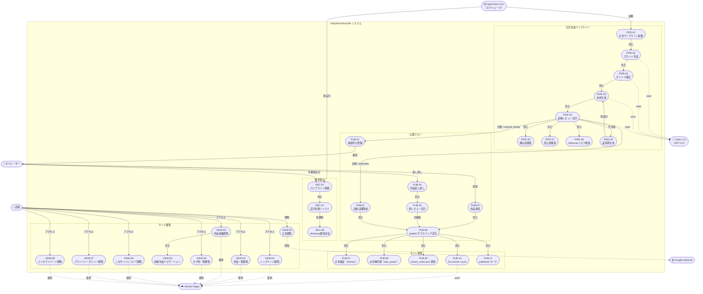
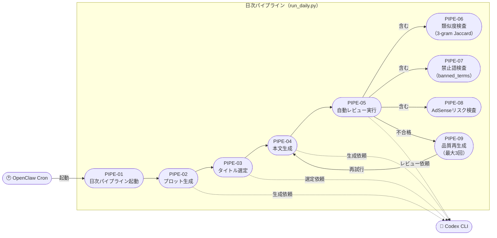
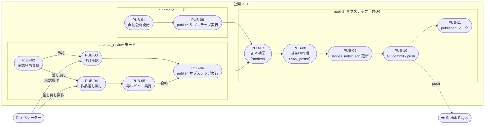
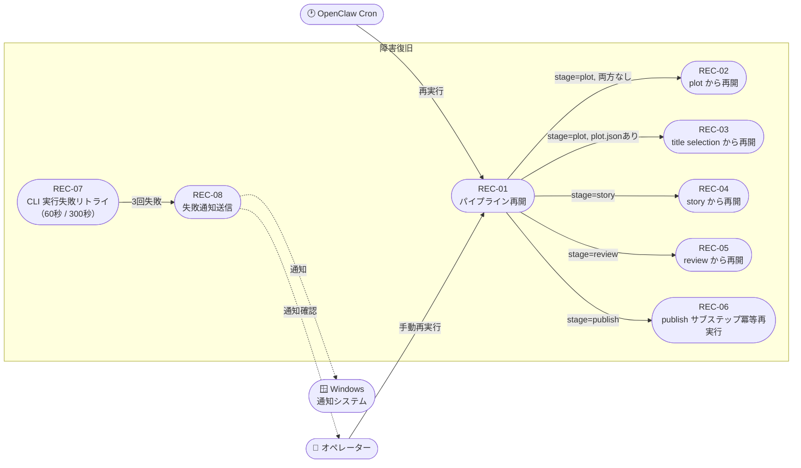
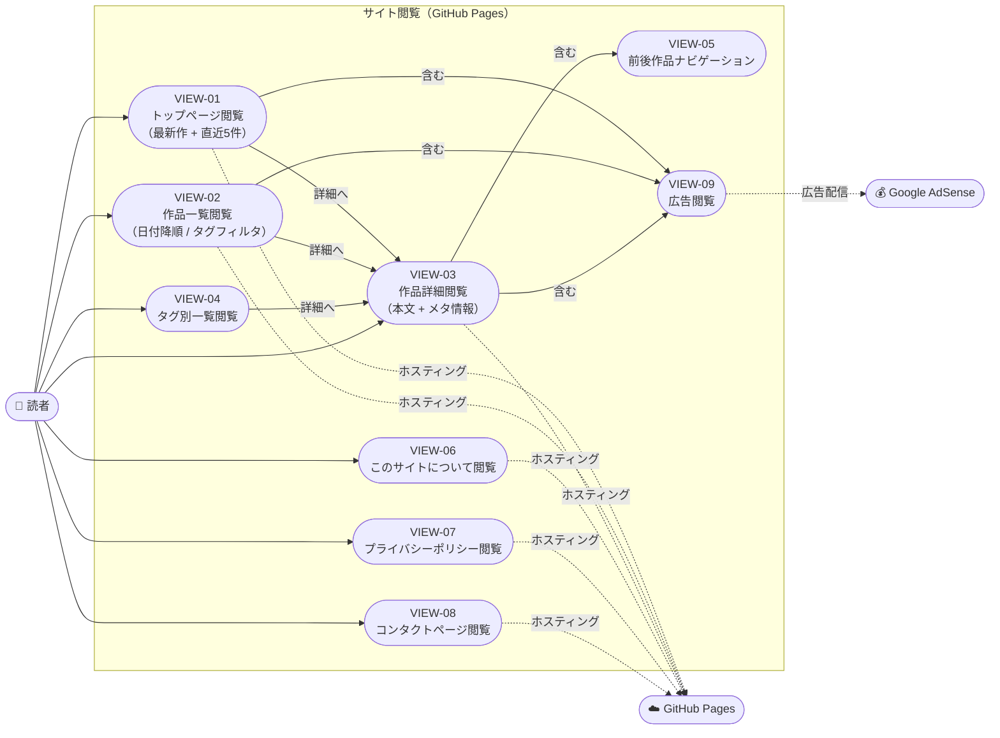

# usecase.md
## 1日1冊短編小説サイト — ユースケース図

**Project:** DailyShortStorySite
**Version:** 1.2.0
**作成日:** 2026-03-09
**参照:** SPEC.md, UI.md, QandA.md

---

## 1. アクター定義

| アクター | 区分 | 説明 |
|---|---|---|
| OpenClaw Cron | 主アクター（システム） | 毎日定時に日次パイプラインを起動するスケジューラ |
| オペレーター | 主アクター（人間） | manual_review モード時に作品を承認・差し戻しする管理者 |
| 読者 | 主アクター（人間） | GitHub Pages 上の公開サイトを閲覧する利用者 |
| Codex CLI | 副アクター（外部システム） | プロット・本文・レビューを生成する AI エンジン |
| GitHub Pages | 副アクター（外部システム） | 静的サイトをホスティングする公開基盤 |
| Google AdSense | 副アクター（外部システム） | 広告配信サービス |

---

## 2. ユースケース図 全体

---

## 3. 日次パイプライン ユースケース詳細

---

## 4. 公開フロー ユースケース詳細

---

## 5. 障害復旧 ユースケース詳細

---

## 6. サイト閲覧 ユースケース詳細

---

## 7. ユースケース一覧

| UC-ID | ユースケース名 | 主アクター | 概要 |
|---|---|---|---|
| PIPE-01 | 日次パイプライン起動 | OpenClaw Cron | 毎日定時に run_daily.py を起動し当日処理を開始する |
| PIPE-02 | プロット生成 | OpenClaw Cron | Codex CLI でテーマ・登場人物・展開・結末を設計する |
| PIPE-03 | タイトル選定 | OpenClaw Cron | Codex CLI で候補を比較採点し最適タイトルを1件選ぶ |
| PIPE-04 | 本文生成 | OpenClaw Cron | Codex CLI でプロット＋タイトルから 2,000〜5,000字の本文を生成する |
| PIPE-05 | 自動レビュー実行 | OpenClaw Cron | 品質・類似度・禁止語・AdSenseリスクを総合審査する |
| PIPE-06 | 類似度検査 | OpenClaw Cron | 直近90日の作品と 3-gram Jaccard >= 0.40 を検出する |
| PIPE-07 | 禁止語検査 | OpenClaw Cron | banned_terms.json に基づき禁止表現を検出する |
| PIPE-08 | AdSenseリスク検査 | OpenClaw Cron | AdSense ポリシー違反リスクを審査する |
| PIPE-09 | 品質再生成 | OpenClaw Cron | レビュー不合格時に本文を最大3回再生成する |
| PUB-01 | 自動公開開始 | OpenClaw Cron | automatic モードでレビュー合格後即座に publish へ進む |
| PUB-02 | 承認待ち登録 | OpenClaw Cron | manual_review モードで pending/*.pending.json を配置する |
| PUB-03 | 作品承認 | オペレーター | pending_review 状態の作品を承認し publish へ進める |
| PUB-04 | 作品差し戻し | オペレーター | 作品を差し戻し stories/ 正本を修正して再レビューへ進める |
| PUB-05 | 再レビュー実行 | オペレーター | 差し戻し後に初回と同一入力セットで再審査する |
| PUB-06 | publish サブステップ実行 | OpenClaw Cron | 正本検証→派生物同期→インデックス更新→git push→published マークを順実行する |
| PUB-07 | 正本検証 | OpenClaw Cron | stories/ に正本 Markdown が存在することを確認する |
| PUB-08 | 派生物同期 | OpenClaw Cron | stories/ から site/_posts/ へ冪等コピーする |
| PUB-09 | stories_index.json 更新 | OpenClaw Cron | 日付降順でアトミック更新する |
| PUB-10 | Git commit / push | OpenClaw Cron | GitHub Pages へ変更を push して公開する |
| PUB-11 | published マーク | OpenClaw Cron | state.json を stage=done, result=published に更新する |
| REC-01 | パイプライン再開 | OpenClaw Cron / オペレーター | state.json の stage を読み取り失敗地点から再開する |
| REC-02 | plot から再開 | OpenClaw Cron / オペレーター | plot artifact がない場合に generate_plot から再実行する |
| REC-03 | title selection から再開 | OpenClaw Cron / オペレーター | plot artifact のみ存在する場合に select_title から再開する |
| REC-04 | story から再開 | OpenClaw Cron / オペレーター | stories/YYYY/ の正本ドラフト有無を見て story から再開する |
| REC-05 | review から再開 | OpenClaw Cron / オペレーター | 初回と同一入力セットで review を再実行する |
| REC-06 | publish サブステップ冪等再実行 | OpenClaw Cron / オペレーター | publish 中断時に公開サブステップをまとめて再実行する |
| REC-07 | CLI 実行失敗リトライ | OpenClaw Cron | 60秒・300秒待機で最大2回再試行する |
| REC-08 | 失敗通知送信 | OpenClaw Cron | powershell.exe 経由で Windows 通知を送信する |
| VIEW-01 | トップページ閲覧 | 読者 | 最新作プレビューと直近5件カードを閲覧する |
| VIEW-02 | 作品一覧閲覧 | 読者 | 日付降順・タグフィルタで全作品を閲覧する |
| VIEW-03 | 作品詳細閲覧 | 読者 | 本文・メタ情報・AdSense広告が配置された詳細ページを閲覧する |
| VIEW-04 | タグ別一覧閲覧 | 読者 | 特定タグでフィルタした作品一覧を閲覧する |
| VIEW-05 | 前後作品ナビゲーション | 読者 | 作品詳細から前後の公開作品へ移動する |
| VIEW-06 | このサイトについて閲覧 | 読者 | /about/ でサイト方針と AI生成方針を確認する |
| VIEW-07 | プライバシーポリシー閲覧 | 読者 | AdSense 対応のプライバシーポリシーを閲覧する |
| VIEW-08 | コンタクトページ閲覧 | 読者 | 連絡先と問い合わせ導線を閲覧する |
| VIEW-09 | 広告閲覧 | 読者 | Google AdSense の広告（記事上部・下部・一覧下部）を閲覧する |

---

*本ドキュメントは SPEC.md §2（スコープ）、§11（AIエージェント構成）、§15〜19（publish・復旧・フロー）、§21（AdSense）に基づいて設計。*
